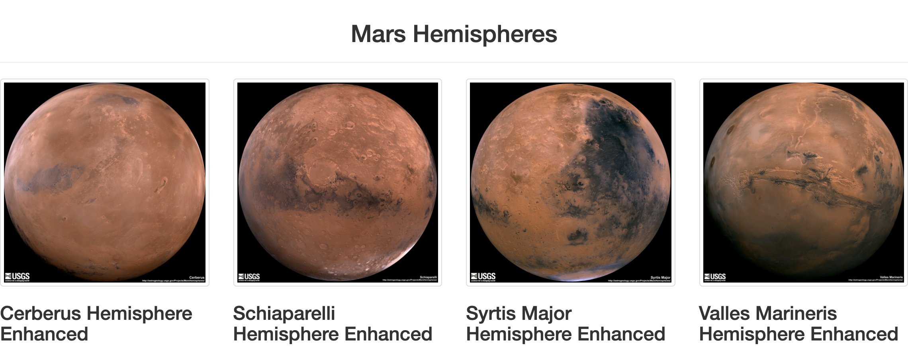
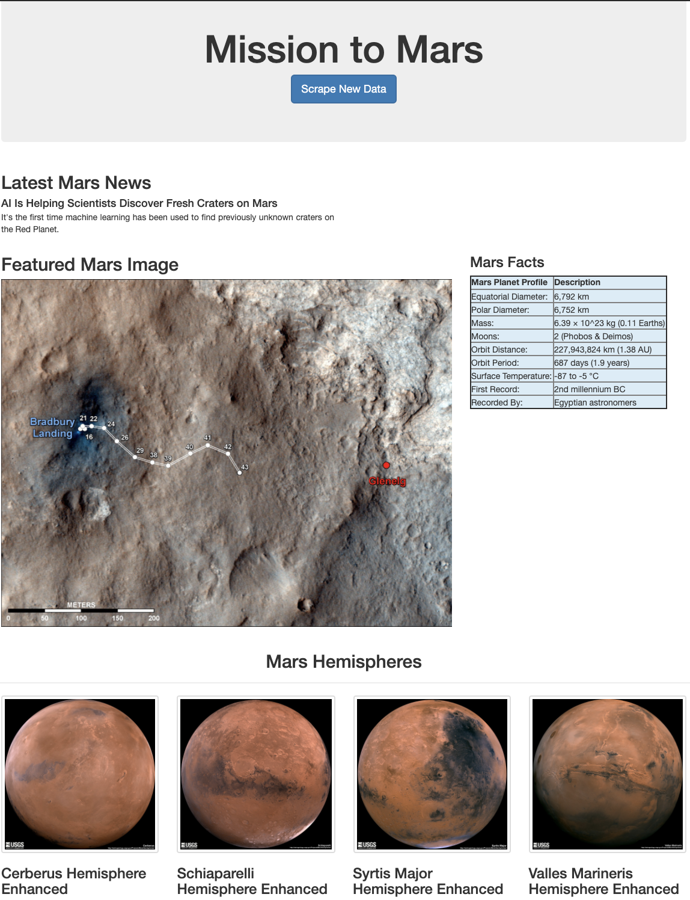

# Mission to Mars Challenge

## Overview
This project demonstrates how to use BeautifulSoup and Splinter to scrape full-resolution of Mars Hemispheres Images and Titles from the following website: https://astrogeology.usgs.gov/search/results?q=hemisphere+enhanced&k1=target&v1=Mars

The project has following files, functions of each of them are defined below:

1 - scraping.py: A python script containing following functions:  
def scrape_all(): 
Initiliazes webdriver using Splinter and executes functions to retrieve Mars data. Returns dictionary "data" containing Mars data.  
def mars_news(browser): 
Parses the html using BeautifulSoup from URL: https://mars.nasa.gov/news/ to retrieve teaser article title and paragraph.  
def featured_image(browser): 
Parses the html using BeautifulSoup from URL: https://www.jpl.nasa.gov/spaceimages/?search=&category=Mars to retrieve featured image. Returns image URL.  
def mars_facts(): 
Uses 'read_html' to scrape the facts table into a dataframe. Returns dataframe in html format.  
def mars_hemispheres(browser): 
Uses BeautifulSoup to retrieve images and title of Mars Hemispheres from URL: https://astrogeology.usgs.gov/search/results?q=hemisphere+enhanced&k1=target&v1=Mars. Returns a list of dictionaries containing image url's and titles for each hemisphere.

2 - app.py: Web app using Flask. Uses MongoDB to create a database to hold Mars data returned from 'scrape_all()' function. Renders index.html with Mars data to be displayed.
## Flask Output
Following is the output showing Mars Hemispheres as thumnails:

Following is the final output of Web App upon hitting "Scrape New Data" button:

